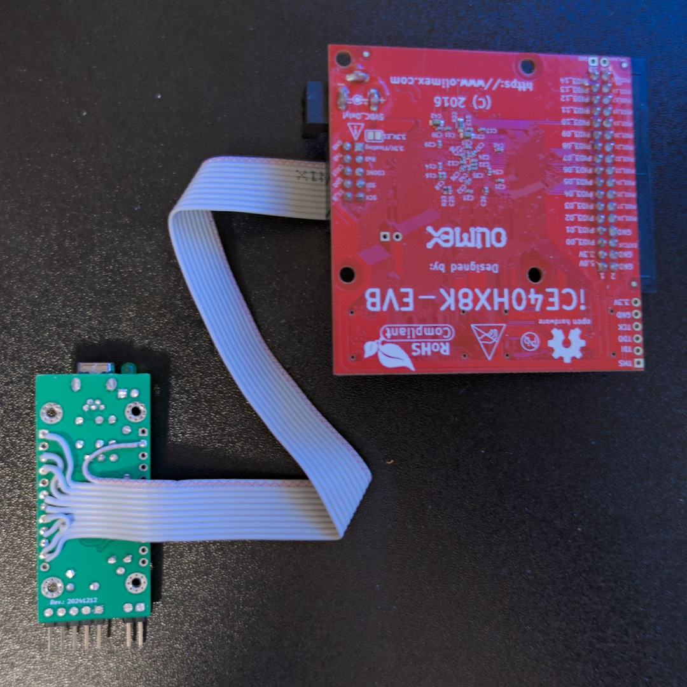

# iceflashprog
A simple USB flash programmer for `iCE40`-based FPGA development boards.


## Description

This is a simple and kinda generic flash memory programmer designed for [Olimex](https://www.olimex.com/)'s line of [Lattice iCE40](https://www.latticesemi.com/Products/FPGAandCPLD/iCE40) [FPGA evaluation boards](https://www.olimex.com/Products/FPGA/iCE40/), due to their standard [`UEXT`](https://www.olimex.com/Products/Modules/) programming headers, but potentially adaptable to any other evaluation boards that use the same FPGAs or flash memories.

The device implements a [USB HID](https://en.wikipedia.org/wiki/USB_human_interface_device_class) interface, which means that it is automatically recognized by any operating system without installing drivers. The `iceflashprog` binary should be used to interact with the device.

The serial port interface available on the `UEXT` header is not implemented (yet?)


## Hardware




The hardware is based on my [`STM32F0` development board](https://rafaelmartins.com/p/stm32-usbd-devboards/#stm32f0-variant), with a flat cable soldered directly to the board, instead of using header pins. The firmware fits the smallest microcontroller supported by the devboard, so any board should work fine for this project.

| Cable wire | `STM32F0` devboard pin | FPGA/`UEXT` pin |
| ---------- | ---------------------- | --------------- |
| 1          | 3.3v                   | 3.3V/Floating   |
| 2          | GND                    | GND             |
| 3          | A9                     | RxD (unused)    |
| 4          | A10                    | TxD (unused)    |
| 5          | B1                     | CDONE           |
| 6          | B0                     | CRST            |
| 7          | A6                     | SDI             |
| 8          | A7                     | SDO             |
| 9          | A5                     | SCK             |
| 10         | A4                     | SS_B            |

The solder jumper connected to Pin 1 of the UEXT header, which is open by default, should **NOT** be closed because the `STM32F0` development board is powered by the USB port.

The development board is straightforward to build, containing mostly PTH parts. The Gerber files are available and can be uploaded to your favorite PCB fabrication house.

Users not willing to build the UEXT cable can instead install header pins on the development board, then connect them with DuPont cables.


### LED pattern

When the device is powered on (or reset, either by the USB host or by the internal watchdog), the LED will stay `ON` until it is successfully enumerated by the USB host. After that, it will be `ON` as long as there is data being transferred to the flash memory via SPI (very fast blinking).


### 3D case

A very simple [3D case model](./3d-models/) is provided. It should be easy to print, and is compatible with M2 self-tapping screws.


## Firmware

This project includes firmware for the `STM32F042` microcontroller available on the development boards. A prebuilt binary is available from the release files. It is compatible with all microcontrollers supported by the `STM32F0` development boards.

The easiest way to flash the binary to the microcontroller is via USB, by using the default DFU bootloader. This requires the installation of the [`dfu-util` binary](https://dfu-util.sourceforge.net/) to the system.

To start the microcontroller in bootloader mode, please connect together the pins marked as "BOOTLOADER" in the devboard, either by using a jumper or a DuPont cable, and then connect the USB cable. If everything is OK, the LED will turn on.

Run the following command to check if `dfu-util` can access the device:
```shell
$ dfu-util -l
```

The last lines should look similar to:
```
Found DFU: [0483:df11] ver=2200, devnum=1, cfg=1, intf=0, path="8-4.4.1", alt=0, name="@Internal Flash  /0x08000000/032*0001Kg", serial="FFFFFFFEFFFF"
Found DFU: [0483:df11] ver=2200, devnum=1, cfg=1, intf=0, path="8-4.4.1", alt=1, name="@Option Bytes  /0x1FFFF800/01*016 e", serial="FFFFFFFEFFFF"
```

After extracting the `.zip` file containing the DFU firmware, from a shell inside the extracted directory, run:

```shell
$ dfu-util -D iceflashprog.dfu
```

If the command reports success, just reset the device, by removing and connecting the USB port, and it should be working!


## Host software

This project includes a program to allow writing and reading the flash memory contained in the FPGA development board from a computer. A prebuilt binary is available from the release files, for Linux (`amd64` and `arm64`), MacOS (`arm64`) and Windows (`amd64`). Other architectures are supported, but users would need to rebuild the application from source. It is written in pure `Go`, so a `Go` compiler `>= 1.24.0` is required for that.

Linux users may need to install a `udev` `.rules` file that is included with the prebuilt binary. MacOS users may need to cleanup quarantine xattrs from the binary before running because it is not signed. As these are operating system quirks not specific to this software, solve it is out of scope of this documentation.

To check if everything is connected and powered correctly, type:
```shell
$ iceflashprog -d
```

It should output something similar to:
```
Manufacturer: 0x1c
Device ID: 0x7015
```

To write a bitstream binary to flash, after erasing it and verifying afterwards, type:
```shell
$ iceflashprog bitstream.bin
```

To read flash memory to a file, type:
```shell
$ iceflashprog -r bitstream.bin
```

For more details on the program options, type:
```shell
$ iceflashprog -h
```


## License

The software is released under a [GNU General Public License v2.0 only](./LICENSE) license.
