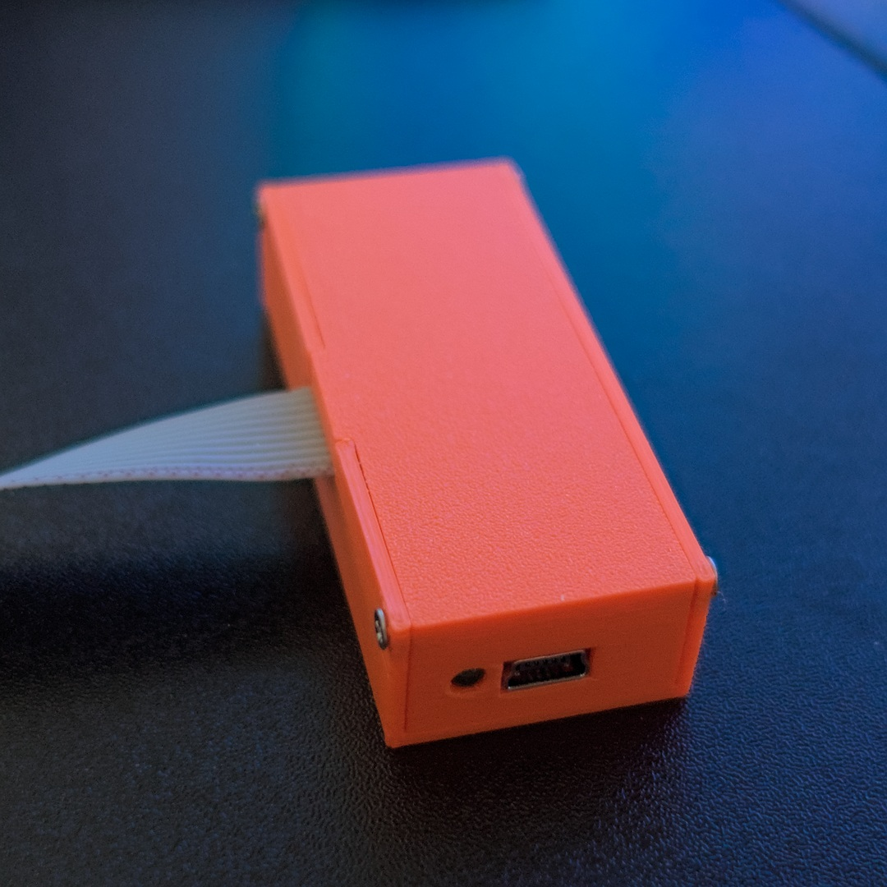

**A simple USB flash programmer for iCE40-based FPGA development boards.**

iceflashprog, assembled in its 3D-printed case

## Overview

iceflashprog is a USB flash memory programmer designed for [Olimex](https://www.olimex.com/)'s line of [Lattice iCE40](https://www.latticesemi.com/Products/FPGAandCPLD/iCE40) [FPGA evaluation boards](https://www.olimex.com/Products/FPGA/iCE40/). It targets boards with standard [UEXT](https://www.olimex.com/Products/Modules/) programming headers, but is potentially adaptable to other evaluation boards that use the same FPGAs or flash memories.

The hardware is based on the [stm32f0-usbd-devboard](@@/p/stm32-usbd-devboards/stm32f0/), running bare-metal firmware on an STM32F042 microcontroller (ARM Cortex-M0, 48 MHz). The device implements a USB HID interface, which means it is automatically recognized by any operating system without installing drivers.

The project includes firmware for the microcontroller and a host software CLI tool, written in Go, for reading and writing the flash memory from a computer. Prebuilt binaries are available for Linux (`amd64` and `arm64`), macOS (`arm64`), and Windows (`amd64`).

> [!NOTE]
> The host software currently only supports 16 Megabit serial flash memories, such as those used in Olimex boards.

## Key Highlights

- **No drivers required** -- USB HID class device, recognized natively by all major operating systems
- **DMA-based SPI** -- uses DMA for SPI flash communication, with automatic write verification after each page write
- **Watchdog protection** -- independent watchdog resets the device if the host stops communicating, preventing lockups
- **Cross-platform host software** -- Go CLI tool with prebuilt binaries for Linux, macOS, and Windows
- **3D-printable case** -- OpenSCAD-designed enclosure compatible with M2 self-tapping screws
- **Open source** -- firmware and host software released under GPL-2.0-only license

## Explore Further

- [Assembly](10_assembly.md) -- hardware wiring, LED behavior, and 3D-printed case
- [Firmware](20_firmware.md) -- building, flashing, architecture, and USB HID protocol
- [Host Software](30_host-software.md) -- installation and usage of the `iceflashprog` CLI tool
- [Source Code](https://github.com/rafaelmartins/iceflashprog) -- GitHub repository
- [stm32f0-usbd-devboard](@@/p/stm32-usbd-devboards/stm32f0/) -- the base hardware for this project
