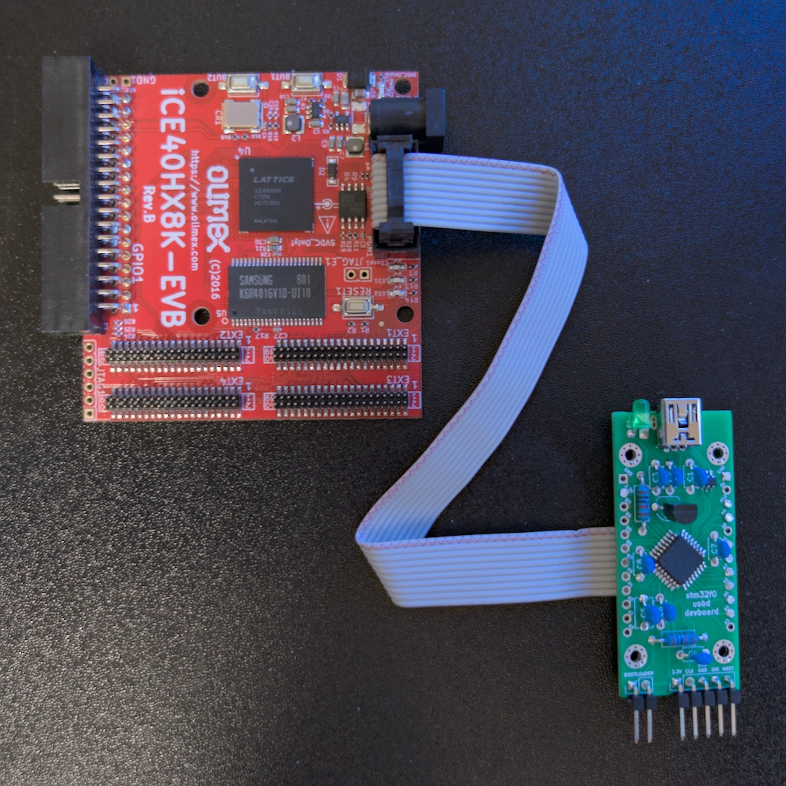

# Assembly

The iceflashprog hardware is based on the [stm32f0-usbd-devboard](@@/p/stm32-usbd-devboards/stm32f0/) with a flat cable connecting it to the FPGA board's [UEXT](https://www.olimex.com/Products/Modules/) header. The firmware fits the smallest microcontroller supported by the devboard (16 KB flash, 6 KB RAM), so any STM32F042K variant works.

iceflashprog, front view

iceflashprog, back view

## Wiring

A 10-wire flat cable connects the development board to the UEXT header on the FPGA board. The cable can be soldered directly to the devboard pads, or standard header pins with DuPont cables can be used instead.

| Cable wire | stm32f0-usbd-devboard pin | FPGA / UEXT pin |
|---|---|---|
| 1 | 3.3V | 3.3V / Floating |
| 2 | GND | GND |
| 3 | A9 | RxD (unused) |
| 4 | A10 | TxD (unused) |
| 5 | B1 | CDONE |
| 6 | B0 | CRST |
| 7 | A6 | SDI |
| 8 | A7 | SDO |
| 9 | A5 | SCK |
| 10 | A4 | SS_B |

> [!WARNING]
> The solder jumper connected to Pin 1 of the UEXT header, which is open by default, should **not** be closed. The stm32f0-usbd-devboard is powered by its USB port.

## LED pattern

When the device is powered on (or reset by the USB host or the internal watchdog), the LED stays on until the device is successfully enumerated by the USB host. After enumeration, the LED turns on whenever there is SPI data being transferred to the flash memory.

## 3D-printed case

A simple [OpenSCAD case model](https://github.com/rafaelmartins/iceflashprog/tree/main/3d-models) is included in the project repository. The base and cover STL files are ready to print and the case is compatible with M2 self-tapping screws.

iceflashprog in its 3D-printed case

## Firmware

After assembling the hardware, flash the firmware to the microcontroller. See [Firmware](20_firmware.md) for build instructions and flashing methods.
